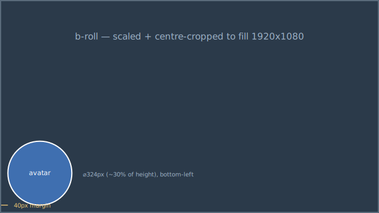

# Avatar Compositor

A small standalone Node CLI that invokes `ffmpeg` to place an avatar/host clip
inside a circular picture-in-picture bubble over full-frame b-roll footage.



## Requirements

- Node.js 22+
- `ffmpeg` (and `ffprobe`) available on PATH, **or** Docker (the image installs them).

## Usage

```bash
node tools/compositor.mjs --avatar assets/frame4.mp4 --broll assets/frame2.mp4 --out outputs/result.mp4
```

The output is a 1920x1080 MP4 where:

- the b-roll is scaled + centre-cropped to **fill** the frame,
- the avatar is cropped into a **324px circular bubble** (~30% of the height) in
  the **bottom-left** corner with a **40px margin**,
- the audio comes from the **avatar** clip (the voiceover),
- the output length equals the **avatar** length; the b-roll is looped
  (`-stream_loop -1`) and trimmed to match.

### Options

```bash
node tools/compositor.mjs \
  --avatar assets/frame4.mp4 \
  --broll  assets/frame2.mp4 \
  --out    outputs/result.mp4 \
  --bubble 324 \
  --margin 40 \
  --position bottom-left \   # or bottom-right / top-left / top-right
  --avatar-center-x 0.5 \    # pan the square crop to centre an off-centre face
  --crf 18 \
  --preset veryfast
```

Run `node tools/compositor.mjs --help` for the full option list.

The avatar is square-cropped before the circular mask. If the subject's face
isn't centred in the source frame, pan the crop with `--avatar-center-x`
(`0`=left … `1`=right; `--avatar-center-y` for tall sources) so the face sits in
the middle of the bubble — e.g. `frame1.mp4` centres nicely at `0.52`.

### Bonus variant: split-screen

```bash
node tools/compositor.mjs --avatar assets/frame4.mp4 --broll assets/frame2.mp4 \
  --out outputs/split.mp4 --variant split
```

Produces a left/right split-screen (avatar left, b-roll right), audio from the
avatar, same length-matching behaviour.

### Full-length voiceover (`--audio`)

By default the output length equals the **avatar clip's** length and the audio is
the avatar clip's own track. If your voiceover is a separate file (e.g. a 37s
`audio.mp3`) and the avatar/b-roll are short snippets, pass `--audio`:

```bash
node tools/compositor.mjs --avatar assets/frame4.mp4 --broll assets/frame2.mp4 \
  --audio assets/audio.mp3 --out outputs/voiced.mp4
```

Then the output length = the **audio** length, that track becomes the soundtrack,
and **both** the avatar bubble and the b-roll loop to fill. Note: a short avatar
clip will visibly loop, and it won't lip-sync to an unrelated voiceover — with
these assets it's a "talking-head b-roll" bubble, not synced narration.

### Background sequence (one avatar, many `--broll`)

Pass **one** `--avatar` and **repeat** `--broll` to lay an ordered background
sequence under a single, persistent avatar bubble:

```bash
node tools/compositor.mjs --avatar assets/frame4.mp4 \
  --broll assets/frame1-background.jpg --broll assets/frame2.mp4 --broll assets/frame3.mp4 \
  --broll assets/frame4-background.png --broll assets/frame5.mp4 --broll assets/frame6.mp4 \
  --broll assets/frame7.mp4 --broll assets/frame8.mp4 --broll assets/frame9.mp4 \
  --audio assets/audio.mp3 --out outputs/result.mp4
```

Design (this is the important part):

- **Background timeline** — the `--broll` list is concatenated **exactly once, in
  order**. Video clips play at their **natural length**; still images
  (`.jpg`/`.png`/…) play for `--still-duration` with a slow **zoom**. Nothing is
  skipped, repeated, or reordered.
- **Avatar timeline** — the avatar is a **single global input**, circle-masked
  once and overlaid once over the whole video. It loops on **its own clock**
  (`-stream_loop -1` + one trim to the total), so it stays on screen for the
  entire duration and never restarts at background boundaries. (It still *loops*,
  because the source clip is shorter than the narration — that's expected; the
  compositor does not synthesise or extend the avatar.)
- **Length** — the total is the **sum of the backgrounds** (so the sequence always
  plays in full). When `--audio`/`--duration` is given, the **still** durations
  auto-fit so the total matches the narration.

## Docker

Docker installs `ffmpeg` inside the image. The default compose command prints
CLI help, so this builds and exits cleanly from a fresh clone:

```bash
docker compose up --build
```

To render, mount your media (via the `assets/` and `outputs/` volumes in
`docker-compose.yml`) and pass paths:

```bash
docker compose run --rm compositor node tools/compositor.mjs \
  --avatar assets/frame4.mp4 \
  --broll  assets/frame2.mp4 \
  --out    outputs/result.mp4
```

## Checks

```bash
npm run check:js
```

`check:js` runs `node --check` on the module and then `--self-test`, which builds
the filter graphs offline and asserts them (no `ffmpeg` needed).

## Notes / tradeoffs

- **No shared ffmpeg helper to mirror.** The brief pointed at `src/ffmpeg.js`,
  but the repo has no `src/` (and no such file in history), so this module ships
  its own tiny wrapper around `child_process.spawn`. Args are always passed as an
  array (never through a shell), so the filter graph needs no shell-escaping and
  there's no injection surface.
- **Circle without image assets.** The bubble alpha is punched with `ffmpeg`'s
  `geq` at 2x size and downscaled, which anti-aliases the edge — no PNG masks or
  runtime dependencies.
- **Exact duration.** `ffprobe` reads the driving clip's duration (the avatar,
  or the `--audio` track when given) and passes `-t`; if `ffprobe` is unavailable
  it falls back to `-shortest`.
- **Sample media is not committed** (it's large). Drop clips in `assets/` or pass
  any paths. `outputs/` and `assets/` are git-ignored.

## How I approached it (and what I'd improve)

Single self-contained `ffmpeg` filter graph: cover-fill the b-roll, centre-crop
the avatar to a square, mask it into a circle, overlay bottom-left; the avatar
drives duration and is the only mapped audio. Zero npm dependencies, so the
Docker build only needs `apt` for `ffmpeg`. With more time I'd add a real
background-removed "cutout" variant (needs a matting model — `ffmpeg`
color-keying can't isolate a host on a non-uniform background), an optional
bubble border/shadow, and a tiny fixture-based regression test on a couple of
sampled output frames.
